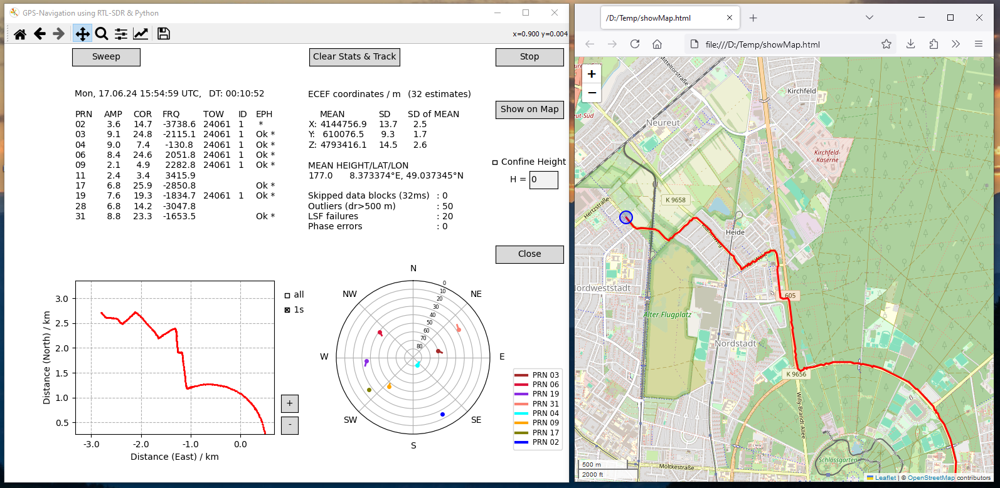

# GPS-SDR-Receiver: Real-Time GPS Tracking using RTL-SDR and Python

## Overview

GPS-SDR-Receiver is a Python software for real-time positioning using a low-budget USB stick (RTL-SDR) as GPS receiver. The RTL-SDR receives the radio signals of the GPS satellites on the L1 band (1575.42 MHz), digitizes them and sends the data to a computer (*Software Defined Radio*, SDR). The Python software then decodes the satellite data and determines the geodetic coordinates of the receiver position. The complex calculation in real-time is made possible by the parallel use of all available processor cores of the computer. The GPS track as well as information about the observed satellites is displayed on a graphical user interface and updated every second.

## Table of Contents

- [Features](#Features)
- [Requirements](#Requirements)
- [Help & Docs](#Help-&-Docs)
- [Installation](#Installation)
- [How to run the program](#How-to-run-the-program)
- [Jupyter notebook](#Jupyter-notebook)
- [Visualization and GUI](#Visualization-and-GUI)
- [Screenshot](#Screenshot)
- [Test run with sample data](#Test-run-with-sample-data)
- [Windows, Linux or MacOS?](#Windows,-Linux-or-MacOS?)
- [RTL-SDR](#RTL-SDR)

## Features

- Depending on the computer system up to 12 satellites are used for positioning in real-time.
- Typically the receiver position is measured every 32 ms. With powerful computers, 16 ms or 8 ms are also possible.
- A mean position is determined every second with a standard deviation of 1-5 m depending on the number of used satellites.
- The accuracy of the mean position is in the range of 1-10 m. Larger deviations are obtained when the number of active satellites falls below 6. Better results are achieved with 10 or more satellites. However, since transient signal delays in the atmosphere are not accounted for, the systematic deviation can exceed 20 m in rare cases.

## Requirements

The program runs in Python 3.11.6 or higher and has been tested on Ubuntu 24.04, Windows 10 & 11, and MacOs 15. 

To use the program, you need

- an installation of the Python code --> [Installation](#Installation) 
- an RTL-SDR device and a GPS antenna --> [RTL-SDR](#RTL-SDR)

If you do not have an RTL-SDR for real-time measurements, you can try out the program using the sample data provided in the data folder (see [Test run with sample data](#Test-run-with-sample-data)).


## Help & Docs

The program code is documented in detail as part of an interactive tutorial (Jupyter notebook) published on Github:

https://github.com/annappo/GPS-Tutorial

The tutorial is intended as an introduction to satellite navigation. The systematic approach with a step-by-step description of the basics is well suited as accompanying material for introductory courses at colleges or universities. The focus is on the development of Python code for measuring and decoding GPS data. For beginners, help is provided for installing the software.

## Installation

The files and folders of the project are organized in the following way:

    .
    ├── LICENSE
    ├── README.md
    ├── requirements.txt
    ├── gpssdr.py
    ├── src
    │   ├── __init__.py
    │   ├── cacodes.py
    │   ├── gpsbin.py
    │   ├── gpseval.ipynb
    │   ├── gpseval.py
    │   ├── gpsglob.py
    │   ├── gpslib.py
    │   ├── gpsrecv.py
    │   └── gpsui.py
    └── data
        ├── Screenshot.png
        └── test.bin

Simply copy all files to a directory of your choice by retaining the given folder structure. This can be done by downloading the project as ZIP file or by cloning the repository, 

```
git clone https://github.com/annappo/GPS-SDR-Receiver
```

Furthermore, the following modules are required:
 
        pyrtlsdr[lib]    # Python interface to librtlsdr
        setuptools       # required by pyrtlsdr
        numpy            # library for scientific computing
        scipy            # ditto
        gpxpy            # library of GPS track exchange format
        matplotlib       # graphical user interface and plots
        folium           # visualization of tracks on OpenStreetMap
        PyQt5            # set of Python bindings for Qt v5

If these modules are not yet available on your system, it is recommended to use a virtual environment for installation, e.g. 

```
python -m venv (env name)
```

After activation of the virtual environment, all modules can be installed at once by 

```
pip install -r requirements.txt
```

For a manual installation of single modules use

```
pip install (module name)
```

On the MacOS operating system, Python and most of the required modules can be installed with the [HomeBrew](https://brew.sh) package manager. To access the RTL-SDR via the USB interface, the driver libusb is required, which is also installed with Homebrew. Please note that the maximum UDP message length on MacOS (default is 9216 Byte) must be increased, e.g. by 

```
sudo sysctl -w net.inet.udp.maxdgram=65500
```

An installation on Windows requires a WinUSB driver for accessing the RTL-SDR. This is installed using the [Zadig](https://zadig.akeo.ie/) software. Read the [Instructions](https://github.com/pbatard/libwdi/wiki/Zadig) carefully before installation. 

Depending on the operating system or Python distribution used, problems may occur, especially when installing the RTL-SDR drivers. You can find help on this in the GPS tutorial (see [Help & Docs](#Help-&-Docs)).
	
## How to run the program

The program code consists of two largely independent parts. The script *gpsrecv.py* receives and decodes the satellite signals. The results are serialized as *pickle* data and transferred to the script *gpseval.py* via the network interface (*UDP* protocol). The data is analyzed and the results displayed on a graphical user interface (GUI). Both scripts are started together by 

```
python gpssdr.py
```

The relevant parameters of the program are defined as global variables in the module *gpsglob*. Before running the program, the values should be checked and changed if necessary. In particular, the settings of the following variables should be inspected (indicated here with default values):

    MEAS_TIME = 6000        # measurement time in seconds
    LIVE_MEAS = False       # True for real-time tracking 
    BIN_DATA = 'test.bin'   # filename for IQ data
    SAVE_TRACK = False      # save track of fixed positions as gpx file 
    REL_PATH = '../data'    # folder for loading and saving data given
                            # as relative path to 'src' directory
    SDR_FREQCORR = 0        # in ppm; offset correction of RTL-SDR
    UDP_PORT = 61431        # two consecutive ports for data transfer
    MAX_SAT = 11            # max number of used satellites 

When using the RTL-SDR for real-time tracking (*LIVE_MEAS=True*), it is important to set the correct offset correction for the frequency, otherwise you may not be able to use all currently available satellites (see [RTL-SDR](#RTL-SDR)). If the default UDP ports are already in use, you can select two other consecutive ports from the range of 49152 to 65534. The *MAX_SAT* parameter should be set according to the performance of your computer processor. In case of many (phase-) errors, you should reduce the value. 

If *LIVE_MEAS* is set *False*, the RTL-SDR device is not accessed and the file in *BIN_DATA* is used as the data source instead. There are further global variables to control the program flow, e.g. *SAVE_PICKLE* and *LOAD_PICKLE*. These can be used to save the receiver results and evaluate them later.

The receiver is terminated either because the measurement time has expired (*MEAS_TIME*), *EOF* has been reached in the data file, or by clicking on the *Stop* button of the user interface (see [Visualization and GUI](#Visualization-and-GUI)). The program is closed by the *Close* button. The results are saved before exiting according to the settings in the module *gpsglob*. 	


## Jupyter notebook

Instead of using the Python script *gpseval.py*, which is based on the PyQt5 library, the program can also be executed in a *JupyterLab* environment using the notebook *gpseval.iypnb*. The script *gpsrecv.py* is started as a subprocess within the notebook. An interesting feature of the notebook is that the measurement results can be further analyzed in parallel to the GPS tracking, even with the creation of additional graphics. Due to the use of concurrent processes (*asyncio*) for the evaluation, the code is not identical in all parts to the PyQt5 version. To use the notebook version, *JupyterLab* and the module *ipympl* must be installed beforehand.


## Visualization and GUI

The GUI is divided into four areas (see *Screenshot* below):
  
  1. A text output shows satellite information with signal and correlation amplitude, Doppler frequency, time of week TOW, subframe ID and status of the ephemeris table. An asterisk ("*") indicates whether a satellite currently contributes to the position fixing.
  2. A second text output displays the mean position in ECEF and geographical coordinates (MEAN) as well as the standard deviation (SD) and standard deviation of the mean (SD of MEAN). Information on skipped data, outliers and phase errors is reported.
  3. A track of mean positions in local coordinates averaged over a second is displayed as a line plot (red). Optionally, a point cloud (blue) of all positions can be overlayed.
  4. A second plot shows the current and past satellite positions from the receiver's point of view in a polar diagram (elevation and azimuth angle).

The user interacts with the program via buttons and keystrokes. The following actions can be triggered:

  1. *Navigation toolbar*: The tools can be used to change the plot settings.
  2. *Sweep*: Search for new satellites (with removal of inactive satellites).
  3. *Clear stats & track*: Reset the statistics and delete the track in the plot. The results and the track saved at the end of the program are not affected.
  4. *Height*: If known, the height (as defined in the WGS84 model of the Earth) can be set and activated as an additional condition for the positioning.
  5. *Show on Map*: The track is displayed on a geographical map in a browser (OpenStreetMap). An Internet connection is required to generate the map.
  6. *Stop*: Stop the GPS receiver.
  7. *Close*: Close the program.


## Screenshot
 


The left window shows the user interface during real-time tracking of a car journey in Karlsruhe, Germany. The red line in the graph displays the track of the measured mean positions and is updated every second. A polar plot shows the positions of the satellites (with PRN numbers) from the viewpoint of the receiver. Of the 10 satellites found, 7 are active, i.e. their ephemerides have been successfully read ("Ok") and they regularly contribute to the position fixing ("*"). The required information for the remaining satellites is not yet complete, as satellites PRN02 and PRN28 have only just been found in a frequency sweep and satellite PRN11 has too weak a signal. The signal strengths given for amplitude and correlation refer to their mean noise amplitude (rms) and are direct measures of their signal-to-noise ratios. The figures for TOW and ID show whether a subframe was decoded in the passed 6 seconds. 

If an Internet connection is available, the GPS track can be displayed on a geographical map at any time using the button *Show on Map* (right window). This is a simple way of checking the quality of the positioning - the example shown is reasonably representative of this.  


## Test run with sample data

The default values in *gpsglob* are set so that the sample data *test.bin* provided in the data folder is used when the program is excuted, e.g. by 

```
python gpssdr.py
```

If everything goes smoothly, several subframes from 11 satellites are calculated and displayed. However, the permitted file size on Github is too small for positioning. As an alternative you can download a larger data file from [HiDrive Share](https://my.hidrive.com/share/ngox89fz9p). The result for the geodetic coordinates of the mean position is (49.082961°N, 8.307581°E) with an SD of MEAN of about 1 m.

The sample data was created by saving the output of an RTL-SDR (stream of IQ values, 2x8 bit) to a file using the Python script *gpsbin.py* from the *pycode* folder.


## Windows, Linux or MacOS?

GPS-SDR-Receiver can be operated under Windows without any problems, but it turned out to run about twice as fast under Linux and MacOS (on the author's systems). Thus, real-time tracking was possible on the same computer with 11 satellites under Linux, but at best with 7 under Windows. If you are a Windows user, it is therefore recommended to use GPS-SDR-Receiver in a WSL environment under Windows (Windows subsystem for Linux, see [Help & Docs](#Help-&-Docs)).


## RTL-SDR

The RTL-SDR is a low-budget USB stick that was originally developed for the reception of radio programs and television via DVB-T (Digital Video Broadcasting - Terrestrial). It can be used to receive signals from GPS satellites though this was not originally intended. For general information and first steps for its use, see [Help & Docs](#Help-&-Docs) or, e.g. 

- https://osmocom.org/projects/rtl-sdr/wiki
- https://www.rtl-sdr.com

### Properties

Three different RTL-SDR dongles were used to measure the GPS signals, all of which show similar performance (signal-to-noise ratio): RTL-SDR Blog V3, Nooelec NESDR SMArTee (both with R820T2 tuner) and Nooelec NESDR SMArTee XTR (E4000 tuner). Their common features are:

- Temperature compensated oscillator (TCXO) < 1 ppm . Offset and drift are around +- 2 ppm.
- Power supply of 4.5 V through coaxial cable for active antennas or low-noise preamplifiers (bias tee).

### GPS antenna

An active antenna with integrated amplifier for the L1 band is required to receive the weak GPS signals. Such antennas are available for little money. The required features are

- GPS 1575.42 MHz ± 3 MHz; gain: approx. 30 dB; power supply: 3-5 V; 3 m cable; SMA connector

### Usage

Satellite signals are only received if there is direct visual contact. Buildings can therefore impair reception, especially if the satellites are close to the horizon. It is also important to set the frequency offset correctly. With a mismatch of 1 ppm, the received Doppler frequencies change by 1542.42 Hz, so that some of them may lie outside the searched range of ±5 kHz. A comparison with a map of the currently visible satellites can be helpful for the correction (see e.g. [Live World Map of Satellite Positions](https://in-the-sky.org/satmap_radar.php)).


